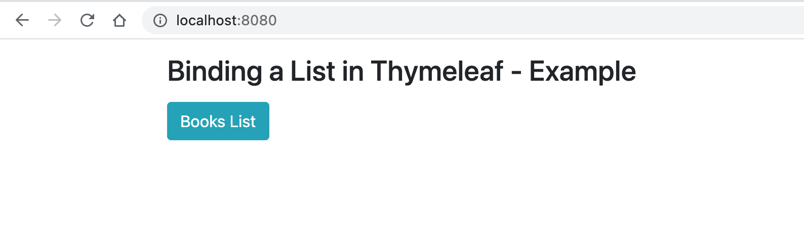
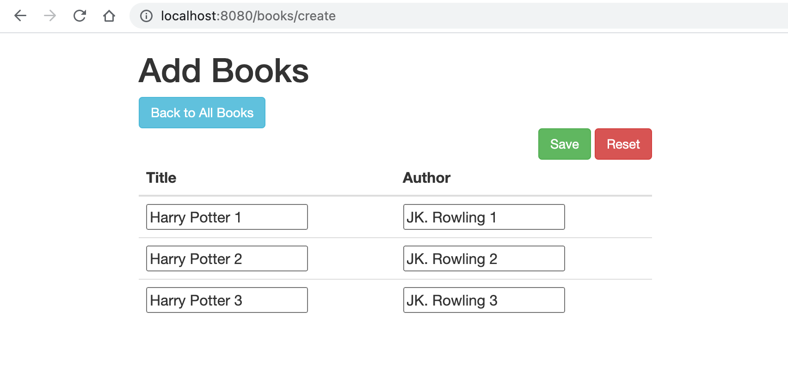
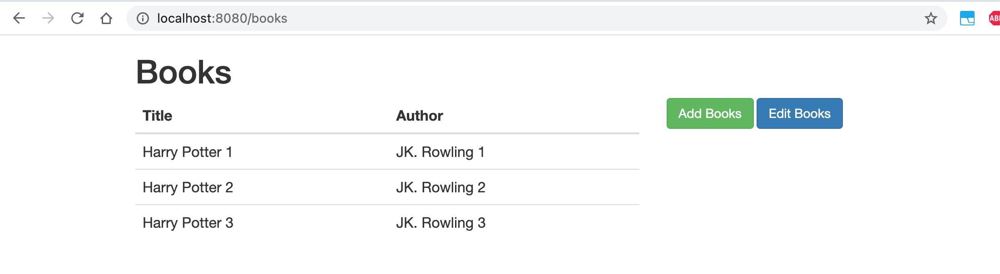
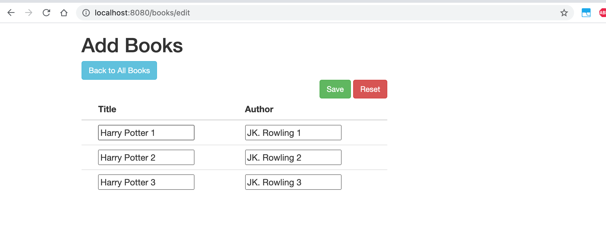

# spring-boot-binding-list-thymeleaf

### Things to do list

1. Clone this repository: `git clone https://github.com/hendisantika/spring-boot-binding-list-thymeleaf.git`
2. Navigate to the folder: `cd spring-boot-binding-list-thymeleaf`
3. Run the application: `mvn clean spring-boot:run`
4. Open your favorite browser: http://localhost:8080/books

### Images Screen shot

Home Page

Add New Book

List All Books

Edit All Books

### Relevant articles

- [Session Attributes in Spring MVC](https://www.baeldung.com/spring-mvc-session-attributes)
- [Binding a List in Thymeleaf](https://www.baeldung.com/thymeleaf-list)
- [Multipart Request Handling in Spring](https://www.baeldung.com/sprint-boot-multipart-requests)
 
